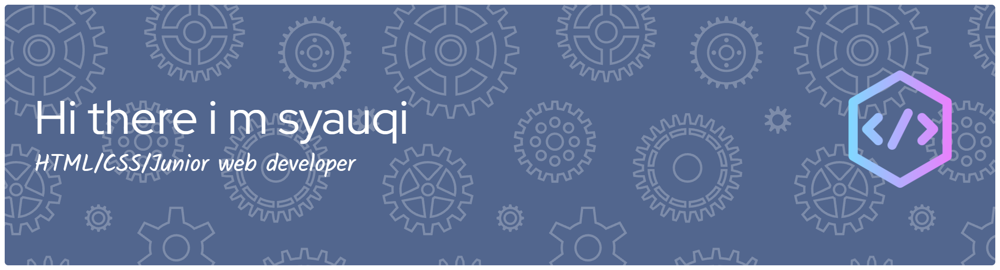

# HELLO BROO 👋

<!--
**syauqiatsaala-netizen/syauqiatsaala-netizen** is a ✨ _special_ ✨ repository because its `README.md` (this file) appears on your GitHub profile.

Here are some ideas to get you started:

- 🔭 I’m currently working on ...
- 🌱 I’m currently learning ...
- 👯 I’m looking to collaborate on ...
- 🤔 I’m looking for help with ...
- 💬 Ask me about ...
- 📫 How to reach me: ...
- 😄 Pronouns: ...
- ⚡ Fun fact: ...
-->

- 🔭 I’m a STUDEN **AT SMKI sahabat ilmu**
- 🌱 I’m currently learning **HTML And CSS**

#### skills

  
  
  
  

#### conect white me

